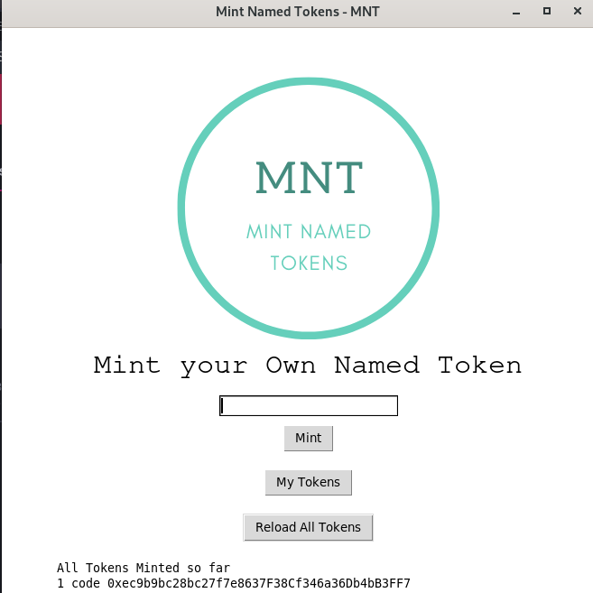

<h1 align="center"> 
web3-projects
</h1>
<h5 align="center">
A collection of all web3 projects in my portfolio
</h5>
<h2> 
01 - Hello World Project
</h2>
<h3>
Built using <b>Truffle Framework</b> and <b>Vuejs3</b>
</h3>
This project is built using the Truffle framework and has a simple smart contract named HelloWorld.sol, which has:
<ul>
<li>one state variable, </li>
<li>one constructor(to initialize that state variable), </li>
<li>two methods - store(to store the value in state variable) and retrieve(to retrieve the value of state variable). </li>
</ul>
Also this project has a frontend build in <b>Vuejs3</b>. The frontend of this project maintains a store(not the vuex store, but custom store based on vuejs3 reactivity) to keep track of data from the blockchain, like the account address, contract ABI, value of state variable, errors, loading status, etc.

<h2> 
02 - Faucet Project
</h2>
<h3>
Built using <b>Truffle Framework</b> and <b>Vuejs3</b>
</h3>
This project is built using the Truffle framework and has a simple smart contract named Faucet.sol, which is:
<ul>
<li>payable, i.e. it accepts incoming payments and stores the amount,  </li>
<li>withdraw() function, to withdraw upto 0.5 ether who-so-ever wants to withdraw</li>
</ul>
Also this project has a frontend build in <b>Vuejs3</b>. The frontend of this project maintains a store(not the vuex store, but custom store based on vuejs3 reactivity) to keep track of data from the blockchain, like the account address, contract ABI, contract address, contract balance, errors, loading status, etc.

<h2> 
03 - Lottery Contract
</h2>
<h3>
Built using <b>Truffle Framework</b> and <b>Reactjs</b>
</h3>
This project is built using the Truffle framework and has a simple smart contract named Lottery.sol, using which:
<ul>
<li>one can enter a lottery by paying the contribution  </li>
<li>manager can pick a winner for Lottery</li>
</ul>
Also this project has a frontend build in <b>Reactjs</b>. Used Tailwind CSS for styling the views.

<h2> 
Mint Named Tokens - MNT
</h2>
<h5>
project built using Truffle suite and Python using web3.py
</h5>

  

# 05 - buildspace x thirdweb - Build your own DAO with just Javascript

### **Welcome 👋**

To get started with this course, clone this repo and follow these commands:

1. Run `npm install` at the root of your directory
2. Run `npm start` to start the project
3. Start coding!

### **Questions?**

Have some questions make sure you head over to your [buildspace Dashboard](https://app.buildspace.so/projects/COb520aae3-7925-42f4-a5e7-eaf718933766) and link your Discord account so you can get access to helpful channels and your instructor!

  

<h1> 
06 - Crowd Funding Project
</h1>
<h3>
Built using <b>Truffle Framework</b> and <b>Vuejs3</b>
</h3>
This project is built using the Truffle framework and has smart contracts naming ProjectFactory, and CrowdFunding:
<ul>
<li>ProjectFactory is used to add a new project for crowd funding, and</li>
<li>CrowdFunding contract allows multiple parties to contribute to a single project.</li>
</ul>
Also this project has a frontend build in <b>Vuejs3</b>. The frontend of this project maintains a vuex store for fetching data and maintaining state and vue-router for routing.

